# OrgDiff — ИИ-агент анализа оргструктуры и функционала

## Описание решения и его назначение

Трек 11, задача «ИИ-агент „Анализ организационной структуры и функционала“».

При реорганизации сотрудник вручную сверяет положения о подразделениях, оргструктуры и приложения к приказам «до» и «после». OrgDiff делает это автоматически. Пользователь загружает оба комплекта документов, а агент:

1. определяет, какие подразделения **созданы, сохранены, реорганизованы или упразднены**, и куда ушли функции упразднённых;
2. сопоставляет функции «до» и «после» и находит **потерю и сужение функций**;
3. находит **дублирование функций, пересечение зон ответственности и признаки конфликта интересов** (по каталогу правил IIA / разделения обязанностей);
4. у **каждого вывода показывает источник**: документ, номер пункта и дословную цитату, автоматически проверенную по тексту;
5. формирует **итоговое заключение с рекомендациями**.

Выводы носят рекомендательный характер: формулировки даны как гипотезы («признаки дублирования»), а вывод без подтверждённой цитаты не показывается (ограничение 9 ТЗ).

## Архитектура

```mermaid
flowchart LR
  U[Браузер: загрузка до/после] -->|POST /api/analyze| API[Next.js API]
  API --> P1[1. Разбор docx/pdf/xlsx на пункты]
  P1 --> P2[2. Состав подразделений и должностей<br/>правило; LLM-фолбэк]
  P2 --> P3[3. Функции и их носители]
  P3 --> P4[4. Выравнивание дословно совпавших пунктов]
  P4 --> P5[5. Эмбеддинги → кандидаты]
  P5 --> P6[6. LLM-сопоставление изменённых функций]
  P6 --> P7[7. Самопроверка потерь по всему документу]
  P7 --> P8[8. Дублирование и пересечения]
  P8 --> P9[9. Конфликт интересов: каталог правил]
  P9 --> P10[10. Проверка каждой цитаты по тексту пункта]
  P10 --> P11[11. Итоговое заключение]
  P11 -->|GET /api/analyze/:id| U
```



Принцип: **детерминированный код везде, где можно, LLM только там, где нужен смысл.**

- Пункты, состав подразделений и носители функций определяются правилами. Они воспроизводимы и не зависят от температуры модели.
- Около 85% пунктов совпадают дословно и сопоставляются без LLM. Модель получает только изменённые (≈57 из 377) вместе с кандидатами, отобранными по эмбеддингам.
- Каждую «потерю» агент перепроверяет вторым проходом по всему документу «после» (паттерн evaluator). Частичное покрытие общими нормами не снимает вывод, но попадает в пояснение.
- Каждая цитата проверяется на вхождение в текст пункта. Вывод без подтверждённого источника отбрасывается.
- Шаги агента видны в интерфейсе как лента прогресса (`trace`).

| Путь | Что там |
|---|---|
| `src/features/orgdiff/types.ts` | контракт между пайплайном и интерфейсом |
| `src/features/orgdiff/lib/parse-clauses.ts` | сегментация на пункты: склеенные пункты, заголовки из оглавления |
| `src/features/orgdiff/lib/units.ts` | подразделения, должности, подчинённость, носители функций |
| `src/features/orgdiff/lib/analyze.ts` | оркестратор агента, сборка выводов и проверка цитат |
| `src/features/orgdiff/lib/judge.ts` | промпты LLM со строгими JSON-схемами, каталог правил КИ |
| `src/features/orgdiff/lib/llm.ts` | клиент OpenAI и дисковый кэш ответов |
| `src/app/api/analyze/` | API: запуск анализа и статус задачи |
| `src/features/orgdiff/components/`, `src/app/dashboard/orgdiff/` | интерфейс |
| `scripts/eval.ts` | проверка качества по эталону и контрольному комплекту |
| `data/` | тестовые документы, контрольный комплект, эталон, кэш ответов LLM |

## Используемые технологии

Next.js 16 (App Router), React 19, TypeScript, Bun, Tailwind 4, shadcn/ui, TanStack Query + Table, React Flow (`@xyflow/react`).
ИИ: OpenAI Responses API, модель `gpt-6-astra` со structured outputs (строгие JSON-схемы); эмбеддинги `text-embedding-3-large`.
Документы: `mammoth` (.docx), `unpdf` (.pdf), `read-excel-file` (.xlsx).

## Системные требования и зависимости

- Bun 1.4+ (или Node.js 20+)
- Доступ в интернет к `api.openai.com` нужен только для **новых** документов. Тестовый комплект и контрольный набор отвечают из кэша `data/cache/` без сети.

## Установка

```sh
git clone https://github.com/BAITC-Hacks/hack-d68591cd-singularity.git
cd hack-d68591cd-singularity
bun install
```

## Параметры окружения

Настраивать ничего не нужно: тестовый ключ хакатона уже лежит в закоммиченном `.env`.

| Переменная | Назначение | Обязательна | Значение по умолчанию |
|---|---|---|---|
| `OPENAI_API_KEY` | ключ OpenAI API | да (уже в `.env`) | тестовый ключ хакатона |
| `OPENAI_MODEL` | модель анализа | нет | `gpt-6-astra` |
| `OPENAI_EMBEDDING_MODEL` | модель эмбеддингов | нет | `text-embedding-3-large` |

Чтобы подставить свой ключ, создайте `.env.local`: он имеет приоритет над `.env` (см. `env.example.txt`).

## Запуск

```sh
bun run dev                        # режим разработки, http://localhost:3000
bun run build && bun run start     # продакшен-сборка
```

Без интерфейса:

```sh
bun run analyze:demo    # анализ тестового комплекта, сводка в консоль
bun run eval            # проверка качества по эталону и контрольному комплекту
```

## Порядок проверки основного сценария

1. `bun run dev` → открыть `http://localhost:3000/dashboard/orgdiff`.
2. Загрузить комплект «до» (`data/before_polozhenie_red8.docx`) и «после» (`data/after_polozhenie_red9.docx`) или нажать «Тестовый комплект».
3. **Ожидаемый результат** (из кэша — за секунды, на новых документах ~2–3 минуты):
   - создано: ДИТААД, ДОА; упразднена должность «Директор направления внутреннего аудита», её функции переданы ДИТААД и ДОА; ДНМ и ДККМ реорганизованы;
   - потери функций: ДККМ — п. 5.6.2 (группы контроля качества), п. 5.6.3 (предложения по внешней оценке), ДНМ — п. 5.7.2;
   - пересечение: анализ результатов непрерывного аудита (пп. 5.3.8 и 5.4.5 новой редакции);
   - конфликт интересов: участие Главного аудитора в органах управления подконтрольных обществ (п. 4.4);
   - у каждого вывода — документ, пункт и цитата; итоговое заключение с рекомендациями.
4. Контрольный комплект с заранее известными изменениями: загрузить «после» = `data/control/after_red9_control.txt`. В нём удалена функция (обучение работников ДККМ), одна функция продублирована в ДНМ, а ДККМ переименован в ДМК.

Через API:

```sh
curl -X POST 'http://localhost:3000/api/analyze?demo=1'          # → {"jobId":"…"}
curl http://localhost:3000/api/analyze/<jobId>                    # статус, шаги агента, результат
curl -X POST http://localhost:3000/api/analyze -F before=@data/before_polozhenie_red8.docx -F after=@data/after_polozhenie_red9.docx
```

### Качество

`bun run eval` сверяет результат с экспертным эталоном `data/control/GOLD.md`: 57 размеченных изменений, цитаты проверены по тексту. Затем прогоняет контрольный комплект. Текущий результат: **16/16 проверок**, 100% цитат найдены в текстах пунктов.

## Раскрытие использованных материалов

**Стартовый шаблон.** Проект стартовал с открытого boilerplate [Kiranism/next-shadcn-dashboard-starter](https://github.com/Kiranism/next-shadcn-dashboard-starter) (MIT): каркас админ-дашборда (layout, sidebar, таблицы, темы, UI-компоненты). До начала соревновательной части из него удалили авторизацию и демо-страницы. Предметной функциональности шаблон не содержал.

**Разработано в ходе соревновательной части:** весь пайплайн анализа (`src/features/orgdiff/lib`), API, интерфейс анализа, эталон и контрольный комплект, скрипт оценки.

**Модели и данные.** OpenAI `gpt-6-astra` и `text-embedding-3-large` через API. Тестовые документы предоставлены организатором.

**AI-инструменты.** Использовались при разработке (п. 5.4.12 разрешает любые AI-инструменты и агенты).

**Библиотеки:** см. `package.json`.

## Лицензия

MIT
