# OrgDiff — ИИ-агент анализа оргструктуры и функционала

## Описание решения и его назначение

Трек 11, задача «ИИ-агент „Анализ организационной структуры и функционала“».

При реорганизации сотрудник вручную сверяет положения о подразделениях, оргструктуры и приложения к приказам «до» и «после». OrgDiff делает это автоматически. Пользователь загружает оба комплекта документов, а агент:

1. определяет, какие подразделения **созданы, сохранены, реорганизованы или упразднены**, и куда ушли функции упразднённых;
2. сопоставляет функции «до» и «после» и находит **потерю и сужение функций**;
3. находит **дублирование функций, пересечение зон ответственности и признаки конфликта интересов** (по каталогу правил IIA / разделения обязанностей);
4. у **каждого вывода показывает источник**: документ, номер пункта и дословную цитату, автоматически проверенную по тексту;
5. формирует **итоговое заключение с рекомендациями** — на экране и файлом Word/Markdown;
6. предлагает, **кому передать утраченные функции** (опция 3 ТЗ): получатель выбирается по собственным функциям подразделений новой структуры, с обоснованием и ссылкой на пункт; для сужений — какой фрагмент вернуть;
7. **сверяет новую редакцию с внешними требованиями** (опция 1 ТЗ): 15 требований к функции внутреннего аудита из стандартов IIA GIAS 2024, Закона РК «Об АО» и 208-ФЗ (`data/requirements.json`, у каждого — номер нормы и ссылка на официальный источник). По каждому требованию агент ставит статус «выполнено / частично / не выполнено / противоречит / не найдено в комплекте» и приводит пункты с дословными цитатами. Цитаты проверяются по тексту, статус без подтверждённой цитаты понижается до «не найдено». Результат — отдельный раздел заключения (Word/Markdown);
8. дополнительно находит **дефекты документа**: ссылки на пункты, которые после перенумерации стали вести на другое содержание.

Выводы носят рекомендательный характер: формулировки даны как гипотезы («признаки дублирования»), а вывод без подтверждённой цитаты не показывается (ограничение 9 ТЗ).

## Архитектура

```mermaid
flowchart LR
  U[Браузер: загрузка до/после] -->|POST /api/analyze| API[Next.js API]
  API --> P1[1. Разбор docx/pdf/xlsx на пункты]
  P1 --> P2[2. Состав подразделений и должностей<br/>правило; LLM-фолбэк]
  P2 --> P3[3. Функции и их носители]
  P3 --> P4[4. Выравнивание дословно совпавших пунктов]
  P4 --> P5[5. Эмбеддинги → кандидаты]
  P5 --> P6[6. LLM-сопоставление изменённых функций]
  P6 --> P7[7. Самопроверка потерь по всему документу]
  P7 --> P8[8. Дублирование и пересечения]
  P8 --> P9[9. Конфликт интересов: каталог правил]
  P9 --> P9b[9б. Кому передать утраченные функции]
  P9b --> P10[10. Проверка каждой цитаты по тексту пункта]
  P10 --> P11[11. Итоговое заключение]
  P11 -->|GET /api/analyze/:id| U
```



Принцип: **детерминированный код везде, где можно, LLM только там, где нужен смысл.**

- Пункты, состав подразделений и носители функций определяются правилами. Они воспроизводимы и не зависят от температуры модели.
- Около 85% функций (пунктов с обязанностями) совпадают дословно и сопоставляются без LLM. Модель получает только изменённые (57 из 377 функций) вместе с кандидатами, отобранными по эмбеддингам.
- Каждую «потерю» агент перепроверяет вторым проходом по всему документу «после» (паттерн evaluator). Частичное покрытие общими нормами не снимает вывод, но попадает в пояснение.
- Каждая цитата проверяется на вхождение в текст пункта (с нормализацией регистра, ё/е, латинских двойников кириллицы). Неподтверждённые цитаты удаляются, вывод без подтверждённых цитат не показывается.
- Шаги агента видны в интерфейсе как лента прогресса (`trace`).

| Путь | Что там |
|---|---|
| `src/features/orgdiff/types.ts` | контракт между пайплайном и интерфейсом |
| `src/features/orgdiff/lib/parse-clauses.ts` | сегментация на пункты: склеенные пункты, заголовки из оглавления |
| `src/features/orgdiff/lib/units.ts` | подразделения, должности, подчинённость, носители функций |
| `src/features/orgdiff/lib/analyze.ts` | оркестратор агента, сборка выводов и проверка цитат |
| `src/features/orgdiff/lib/judge.ts` | промпты LLM со строгими JSON-схемами, каталог правил КИ |
| `src/features/orgdiff/lib/compliance.ts`, `data/requirements.json` | сверка с внешними требованиями (IIA, Закон РК «Об АО», 208-ФЗ) |
| `src/features/orgdiff/lib/llm.ts` | клиент OpenAI и дисковый кэш ответов |
| `src/app/api/analyze/` | API: запуск анализа, статус задачи, выгрузка заключения (`report`) |
| `src/features/orgdiff/lib/report.ts` | итоговое заключение в DOCX и Markdown |
| `src/features/orgdiff/components/`, `src/app/dashboard/orgdiff/` | интерфейс |
| `scripts/eval.ts` | проверка качества по эталону и контрольному комплекту |
| `data/` | тестовые документы, контрольный комплект, эталон, кэш ответов LLM |

## Используемые технологии

Next.js 16 (App Router), React 19, TypeScript, Bun, Tailwind 4, shadcn/ui, TanStack Query + Table, React Flow (`@xyflow/react`).
ИИ: OpenAI Responses API, модель `gpt-6-sol` со structured outputs (строгие JSON-схемы); эмбеддинги `text-embedding-3-large`.
Документы: `mammoth` (.docx), `unpdf` (.pdf), `read-excel-file` (.xlsx). OCR сканов: PaddleOCR PP-OCRv5 (детектор `PP-OCRv5_mobile_det` + распознаватель русского `eslav_PP-OCRv5_mobile_rec`, ONNX, Apache-2.0) в `onnxruntime-node`, растеризация PDF — `mupdf` (WASM).

## Системные требования и зависимости

- Bun 1.4+ (обязательно: все команды и скрипты запускаются через bun)
- Интернет при `bun run build` — для загрузки шрифтов Google (`next/font`).
- Доступ к `api.openai.com` нужен только для **новых** документов. Тестовый комплект и контрольный набор отвечают из кэша `data/cache/` без сети и без ключа.

## Установка

```sh
git clone https://github.com/BAITC-Hacks/hack-d68591cd-singularity.git
cd hack-d68591cd-singularity
bun install
```

## Параметры окружения

Настраивать ничего не нужно: демонстрационный доступ к OpenAI API (п. 5.6.6 Положения) — тестовый ключ хакатона в закоммиченном `.env`. Основной сценарий проверяется и без ключа: тестовый и контрольный комплекты отвечают из закоммиченного кэша `data/cache/` (так же работает `bun run verify`).

| Переменная | Назначение | Обязательна | Значение по умолчанию |
|---|---|---|---|
| `OPENAI_API_KEY` | ключ OpenAI API | да (уже в `.env`) | тестовый ключ хакатона |
| `OPENAI_MODEL` | модель анализа | нет | `gpt-6-sol` |
| `OPENAI_EMBEDDING_MODEL` | модель эмбеддингов | нет | `text-embedding-3-large` |

Чтобы подставить свой ключ, создайте `.env.local`: он имеет приоритет над `.env` (см. `env.example.txt`).

## Запуск

```sh
bun run dev                        # режим разработки, http://localhost:3000
bun run build && bun run start     # продакшен-сборка
```

Без интерфейса:

```sh
bun run analyze:demo    # анализ тестового комплекта, сводка в консоль
bun run eval            # проверка качества по эталону и контрольному комплекту
# свой комплект: несколько файлов на сторону, форматы .docx / .pdf (в т.ч. сканы) / .png / .jpg / .xlsx / .txt
bun scripts/analyze-files.ts --before old.pdf --after new.docx --after prikaz.docx [--json result.json]
```

Что поддерживается на входе, кроме тестовой пары:

- **PDF с текстовым слоем** — строки вёрстки склеиваются обратно в абзацы, номера страниц и колонтитулы отбрасываются; PDF-версия тестовой пары даёт те же 441/442 пункта и те же выводы, что и Word.
- **Сканы: PDF без текстового слоя и картинки .png/.jpg** — распознаются OCR офлайн: PaddleOCR PP-OCRv5 (open-source SOTA, модели 12,7 МБ лежат в `models/ocr/`) в ONNX Runtime, без Python и системных пакетов — всё ставит `bun install`. Строки восстанавливаются сверху вниз с учётом наклона скана, дальше тот же разбор на пункты. На скане тестовой пары (200 DPI, наклон, шум): CER 0,4%, ~2 с на страницу (Mac M, 8 ядер), 440 из 441/442 пунктов с теми же номерами, что у Word-версии; анализ скана через прод-сервер находит те же подразделения и потери функций, что и по Word. Движок выбран сравнением на тех же сканах: tesseract.js 7 (rus) — CER 0,47%, быстрее (~0,6 с/стр.), PP-OCRv5 — точнее (CER 0,41%) и устойчивее на сложных сканах.
- **Несколько документов на сторону** (Положение + приказ о реорганизации) — ссылки на пункты указывают конкретный документ; плоская нумерация «1. Создать …», «2. Упразднить …» разбирается как пункты.
- **Excel (оргструктура / штатное расписание)** — строка заголовка ищется по столбцу «Подразделение»; подразделения, сокращения, руководители и должности берутся по столбцам, ссылка — «стр. N».
- **Другой формат положения** — состав ищется правилами: перечень под «состоит из следующих подразделений», «В состав … входят:» подпунктами или через запятую; иначе — LLM.

## Порядок проверки основного сценария

1. `bun run dev` → открыть `http://localhost:3000/dashboard/orgdiff`.
2. Загрузить комплект «до» (`data/before_polozhenie_red8.docx`) и «после» (`data/after_polozhenie_red9.docx`) или нажать «Тестовый комплект».
3. **Ожидаемый результат** (из кэша — за секунды, на новых документах около минуты):
   - создано: ДИТААД, ДОА; упразднена должность «Директор направления внутреннего аудита», её функции переданы в основном ДИТААД и ДОА (часть — ДНМ и Главному аудитору); ДНМ и ДККМ реорганизованы;
   - потери функций: ДККМ — п. 5.6.2 (группы контроля качества), п. 5.6.3 (предложения по внешней оценке), ДНМ — п. 5.7.2;
   - дублирование: анализ результатов непрерывного аудита у ДИТААД/ДОА и ДНМ (пп. 5.3.8 и 5.4.5 новой редакции);
   - конфликт интересов: участие Главного аудитора в органах управления подконтрольных обществ (п. 4.4);
   - у каждого вывода — документ, пункт и цитата; итоговое заключение с рекомендациями — на экране и файлом Word/Markdown (`/api/analyze/<jobId>/report`).
4. Контрольный комплект с заранее известными изменениями: загрузить «после» = `data/control/after_red9_control.txt`. В нём удалена функция (обучение работников ДККМ), одна функция продублирована в ДНМ, а ДККМ переименован в ДМК.

Через API:

```sh
curl -X POST 'http://localhost:3000/api/analyze?demo=1'          # → {"jobId":"…"}
curl http://localhost:3000/api/analyze/<jobId>                    # статус, шаги агента, результат
curl -OJ http://localhost:3000/api/analyze/<jobId>/report         # итоговое заключение .docx (?format=md — Markdown)
# без состояния сервера, с решениями сотрудника: тело { result, reviews: { "F7": "confirmed", "F25": "rejected" } }
curl -OJ -X POST 'http://localhost:3000/api/report?format=docx' -H 'Content-Type: application/json' -d @request.json
curl -X POST http://localhost:3000/api/analyze -F before=@data/before_polozhenie_red8.docx -F after=@data/after_polozhenie_red9.docx
```

### Качество

`bun run eval` сверяет результат с эталоном разметки `data/control/GOLD.md` (58 размеченных изменений; eval автоматически проверяет 11 ключевых), цитаты проверены по тексту. Затем прогоняет контрольный комплект. Текущий результат: **16/16 проверок**, 100% цитат найдены в текстах пунктов.

Дополнительно eval считает **полноту по всему эталону** (`data/control/gold.json`, раздел 3 вывода). Вывод эталона считается найденным, если у агента есть вывод совместимого вида (например, потеря функции → `function_lost`, передача функций → поток между подразделениями) и этот вывод ссылается хотя бы на один из тех же пунктов. Текущий результат: **14 из 17 вероятных контрольных случаев (82%)** и **16 из 23 выводов с высокой уверенностью (70%)**. Не найдены в основном дефекты документа (ошибки вычитки, ссылки на законодательство РФ) и двойное закрепление контроля устранения недостатков (G27). Одну типовую ошибку, устаревшую ссылку после перенумерации, агент находит. Типы, для которых в агенте нет отдельного вида вывода («функция расширена», «подразделение сохранено», «прочее»), в расчёт не входят. Метрика информационная и на результат проверок не влияет.

## Ограничения прототипа

- Лучше всего разбираются нормативные документы с нумерованными пунктами (положения, регламенты). Excel читается построчно (экспериментально); `.doc` не поддерживается. OCR рассчитан на печатный текст: рукописные пометки, печати и таблицы со сложной вёрсткой распознаются хуже.
- Задачи анализа хранятся в памяти процесса: после перезапуска сервера их нужно запустить заново.
- Анализ новых документов занимает около минуты (пара положений по ~30 страниц); ответы кэшируются в `data/cache/`.
- Выводы — гипотезы для проверки ответственным сотрудником, а не юридическое заключение.
- Сверка с внешними требованиями — ориентир для проверки, не юридическое заключение. Статус «не найдено в комплекте» не означает нарушения: требование может закрываться уставом или другим документом, которого нет в комплекте. Требования РК применимы к АО — резидентам РК, 208-ФЗ — к публичным АО РФ, стандарты IIA — профессиональный ориентир.
- Каталог требований — 15 кратких парафразов норм, а не их полный текст. Номера норм перепроверены по официальным текстам (GIAS 2024 — PDF IIA, Закон РК — adilet.zan.kz, 208-ФЗ — КонсультантПлюс); перечень не исчерпывающий и касается только функции внутреннего аудита.

## Раскрытие использованных материалов

**Стартовый шаблон.** Проект стартовал с открытого boilerplate [Kiranism/next-shadcn-dashboard-starter](https://github.com/Kiranism/next-shadcn-dashboard-starter) (MIT): каркас админ-дашборда (layout, sidebar, таблицы, темы, UI-компоненты). До начала соревновательной части из него удалили авторизацию и демо-страницы. Предметной функциональности шаблон не содержал.

**Разработано в ходе соревновательной части (с 13:00 23.09.2026):** весь пайплайн анализа (`src/features/orgdiff/lib`, первые наброски парсера — 13:53), API, интерфейс анализа, эталон и контрольный комплект, скрипт оценки. Демо-страницы шаблона удалены в ходе работы.

**Модели и данные.** OpenAI `gpt-6-sol` и `text-embedding-3-large` через API. Тестовые документы предоставлены организатором. Эталон `data/control/GOLD.md` размечен ИИ-агентами (три независимые разметки со сведением) с автоматической проверкой каждой цитаты по тексту документа.

**AI-инструменты.** Использовались при разработке (п. 5.4.12 разрешает любые AI-инструменты и агенты).

**Модели OCR:** PaddleOCR PP-OCRv5 (`PP-OCRv5_mobile_det`, `eslav_PP-OCRv5_mobile_rec`), Apache-2.0 — `models/ocr/`. Растеризация PDF — `mupdf` (AGPL-3.0).

**Библиотеки:** см. `package.json`.

## Лицензия

MIT
